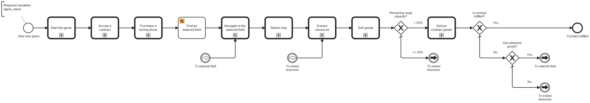
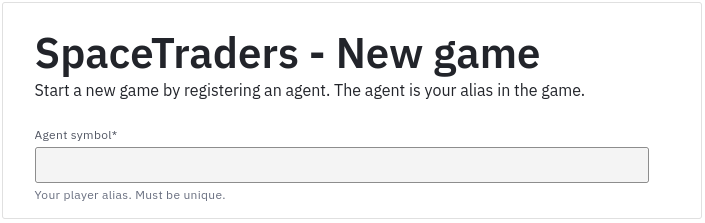

# SpaceTraders Mining Loop Process

This folder contains a BPMN process for SpaceTraders that mines resources in a loop until the contract is fulfilled. 

The process uses the [SDK](../../sdk) and [process blocks](../../process-blocks) to automate the mining.



## Usage

> Requires a Camunda cluster in version 8.3+.

### Via start form

1. Deploy all [process blocks](../../process-blocks)
2. Deploy the process
3. Create a new instance of the process via the start form:
    - Fill in your agent name
    - Submit the form



### Manually

1. Deploy all [process blocks](../../process-blocks)
2. Deploy the process
3. Create a new instance of the process with the following variables:

```json
{
   "agent_name": "The unique name of your agent (i.e. player name)."
}
```