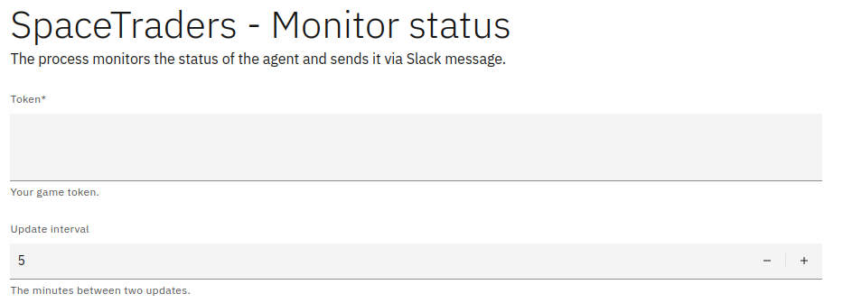

# SpaceTraders Monitor Status Process

This folder contains a BPMN process for SpaceTraders to monitor the player status, for example, current credits,
contract fulfillment, and ship details. The status is sent via Slack message to the player.

The process uses the [SDK](../../sdk) to automate the collect the status data.

## Usage

> Requires a Camunda cluster in version 8.3+.


### Via start form

1. Set the following connector secrets:

```
SLACK_TOKEN // the Slack token to publish the messages with
SLACK_CHANNEL // the Slack channel to publish the messages to
```

2. Deploy the process
3. Create a new instance of the process via the start form:
    - Fill in your game token
    - Optionally, configure the update interval
    - Submit the form



### Manually

1. Set the following connector secrets:

```
SLACK_TOKEN // the Slack token to publish the messages with
SLACK_CHANNEL // the Slack channel to publish the messages to
```

2. Deploy the process
3. Create a new instance of the process with the following variables:

```json
{
  "token": "Your SpaceTraders token that is returned on creating your agent.",
  "interval": 5
}
```
