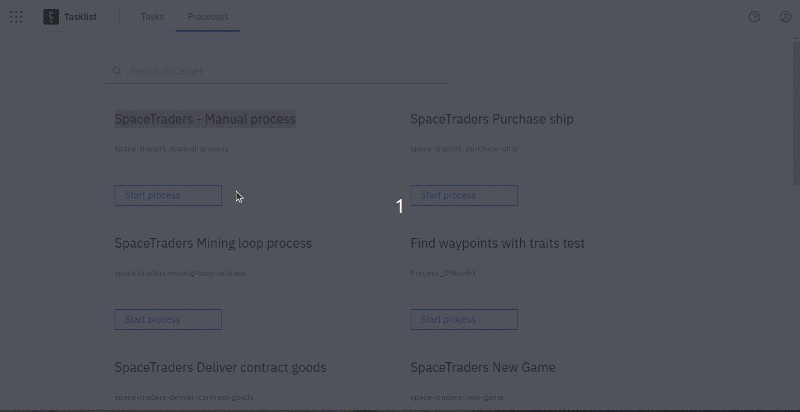

# SpaceTraders Manual Process

This folder contains a manual user-driven BPMN process for the SpaceTraders . It uses Camunda user forms for the 
interaction with the user. The steps are automated using the [SDK](../sdk).

## Usage

> Requires a Camunda cluster in version 8.3+.

1. Deploy the process
2. Open Camunda Tasklist
3. Go to "Processes"
4. Select "SpaceTraders - Manual Process"
5. Fill in the form to create a new game or continue an existing game
6. Wait until the user form "Control center" is shown
7. View the data in the form and select your next action 

