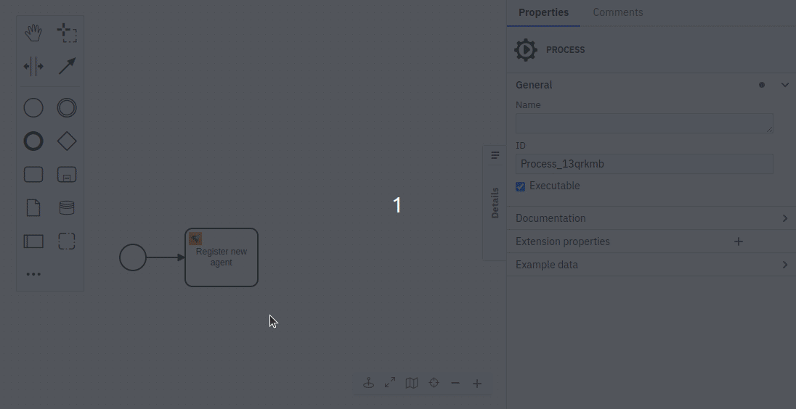

# SpaceTraders SDK for Camunda

The SDK allows to interact with the SpaceTraders API from a Camunda process. It is based on Camunda's REST connector.
The SDK eases the usage by providing a connector template.

The connector template is generated from the SpaceTraders OpenAPI. See the [openapi](/openapi) module for details.

## Install

### Via Camunda Marketplace

1. Find the SDK in the [Camunda Marketplace](https://marketplace.camunda.com/en-US/apps/420889/spacetraders-sdk)
2. Click the button "For SAAS". You will be forwarded to the Camunda Web Modeler.
3. On the download modal, select a project to publish the connector to.

The connector is now available within the select project. :rocket:  

### Manually for Web Modeler

1. Open the [Camunda Web Modeler](https://modeler.cloud.camunda.io/)
2. Open a project or create a new one.
3. Upload the connector template [spacetraders.json](spacetraders.json) (see [how](https://docs.camunda.io/docs/components/connectors/manage-connector-templates/#importing-existing-connector-templates))
4. Publish the connector template (see [how](https://docs.camunda.io/docs/components/connectors/manage-connector-templates/#create-connector-templates))

## Usage

The [SpaceTraders API](https://spacetraders.stoplight.io/docs/spacetraders/11f2735b75b02-space-traders-api) has the different endpoints that are split into the following categories: 

- **Game**: register a new agent, get server status
- **Agents**: get details about an agent
- **Contracts**: get details about a contract, interact with a contract (e.g. accept, deliver, fulfill)
- **Systems**: get details about a star system (e.g. waypoints, shipyard, market)
- **Fleet**: get details about a ship, interact with a ship (e.g. dock, orbit, navigate, extract resources, sell cargo)
- **Factions**: get details about a faction

The connector can interact with all endpoints. First, you select a category and then an operation to use. 

### Add a connector to your process

1. Add a new task to your process
2. Select the SpaceTraders **connector** as the task type (e.g. `SpaceTraders`)
3. Select the **category** in the properties (e.g. `Fleet`)
4. Select the **operation** (e.g. `getMyShip - Get Ship`)
5. Fill the required **parameters** (e.g. `shipSymbol`)
6. Optionally, adjust the **result expression** to customize the resulting process variables

### Authentication

Most of the API calls require a token. The token is generated on creating a new agent.

By default, the connector read the token from the process variable with the name `token`.

If you use a different variable for the token, or store the token as a connector secret, you need to adjust the
authentication property of the connector.

## Useful resources and tools

Resources:

- [SpaceTraders documentation](https://docs.spacetraders.io/)
- [SpaceTraders API (interactive)](https://spacetraders.stoplight.io/docs/spacetraders)
- [Camunda FEEL documentation](https://docs.camunda.io/docs/components/modeler/feel/language-guide/feel-expressions-introduction/)

Tools:

- [FEEL Playground](https://camunda.github.io/feel-scala/docs/playground/)

## Examples

- Automated [Quickstart process](../examples/quickstart) using the SDK
